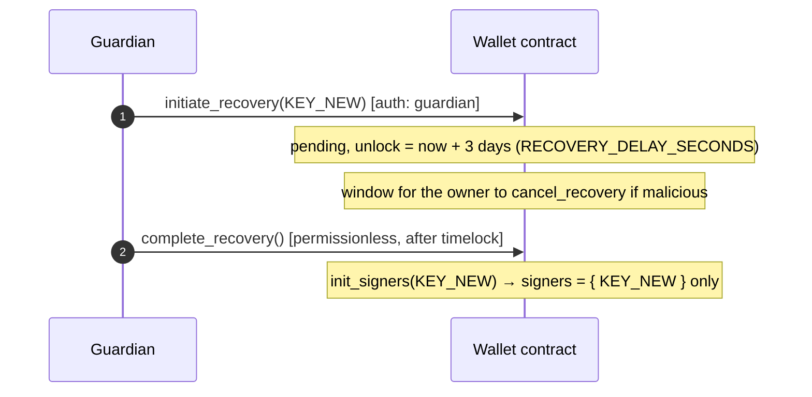

import { Callout } from 'nextra/components'

# Passkey Key Rotation

Rotating a passkey means **adding** the new signer and **removing** the old one.
Because these are two distinct authorizations against the wallet contract, there
is a window in which *both* keys are valid signers. This page documents that
window, explains why it is small, and lists the mitigations that have been
tested against the [`invisible_wallet`](/contract-api) contract.

<Callout type="info">
  This is a companion to the [Threat Model](/threat-model) (see threats S-1, D-3)
  and the [Security](/security) overview. Read those first for the attacker model
  and trust assumptions this page builds on.
</Callout>

---

## Why a window exists

The wallet contract stores signers in an indexed map and exposes two
self-authorized entry points:

| Function | Authorization | Guardrail |
|---|---|---|
| `add_signer(new_public_key)` | `current_contract_address().require_auth()` — an existing signer must approve via `__check_auth` | Returns the new signer index |
| `remove_signer(index)` | `current_contract_address().require_auth()` | Rejects removal that would leave **zero** signers (`CannotRemoveLastSigner`) |

A naive rotation issues these as **two separate transactions**:

```
add_signer(KEY_NEW)      →  ledger N
remove_signer(idx KEY_OLD) →  ledger N + k
```

Between ledger `N` and `N + k`, `has_signer(KEY_OLD)` and `has_signer(KEY_NEW)`
are *both* true. If the reason for rotation is that `KEY_OLD` is suspected
compromised, an attacker who still controls `KEY_OLD` can authorize a transfer
during this overlap.

---

## Timeline of the overlap

```mermaid
sequenceDiagram
    autonumber
    participant U as User (KEY_OLD)
    participant W as Wallet contract
    participant A as Attacker (holds KEY_OLD)

    Note over W: signers = { KEY_OLD }
    U->>W: add_signer(KEY_NEW)  [auth: KEY_OLD]
    Note over W: signers = { KEY_OLD, KEY_NEW } ← overlap begins
    rect rgb(60, 30, 30)
        Note over W,A: OVERLAP WINDOW — both keys valid
        A-->>W: transfer(...) [auth: KEY_OLD] — succeeds if reached here
    end
    U->>W: remove_signer(idx KEY_OLD)  [auth: KEY_NEW or KEY_OLD]
    Note over W: signers = { KEY_NEW } ← overlap ends
```



The size of the window is the wall-clock time between the two transactions
confirming — one to a few Soroban ledgers (roughly 5–10 s each) for a
back-to-back submission, or arbitrarily long if a client crashes, loses
connectivity, or abandons a half-finished rotation.

---

## Why the window is small in practice

1. **Self-authorization gates every rotation op.** Both `add_signer` and
   `remove_signer` route through `__check_auth`, so an attacker cannot *start* a
   rotation. The window can only be opened by a legitimate signer, and only the
   `remove_signer` leg is outstanding.

2. **Nonce binding prevents replay.** `__check_auth` increments the contract
   nonce on every authorized call and binds each WebAuthn/session assertion to
   the host `signature_payload`. A captured `add_signer` assertion cannot be
   replayed to re-open or extend the window.

3. **The dangerous case is narrow.** The overlap only matters when `KEY_OLD` is
   *already* in adversarial hands. For routine rotation (lost device, periodic
   hygiene) where `KEY_OLD` is still solely the user's, the overlap is benign —
   two honest keys.

4. **Last-signer protection cannot be abused to widen it.** `remove_signer`
   refuses to drop the final signer (`CannotRemoveLastSigner`), so a rotation
   can never accidentally lock the wallet and strand it mid-window.

---

## Tested mitigations

The mitigations below correspond to behavior covered by the contract test suite
(`contracts/invisible_wallet/src/lib.rs`, `test_add_signer_returns_index`,
`test_remove_signer`, `test_reject_remove_last_signer`) and the recovery
timelock tests.

### 1. Atomic rotation (recommended) — window ≈ 0

Submit `add_signer` **and** `remove_signer` in a **single transaction**, covered
by **one** WebAuthn assertion. Soroban executes the operations atomically: the
new key is registered and the old key is removed in the same ledger close, so
`KEY_OLD` is never independently usable after the rotation commits, and the
whole rotation reverts together on any failure.

```ts
// Both invocations ride one transaction → one signature_payload → one passkey tap.
const tx = new TransactionBuilder(feePayerAcct, { fee, networkPassphrase })
  .addOperation(wallet.call('add_signer', nativeToScVal(KEY_NEW, { type: 'bytes' })))
  .addOperation(wallet.call('remove_signer', nativeToScVal(oldIndex, { type: 'u32' })))
  .setTimeout(30)
  .build()
// simulate → assemble → sign once with the passkey → submit
```

<Callout type="warning">
  Order matters: `add_signer` must precede `remove_signer` in the operation list.
  Removing first would momentarily hit `CannotRemoveLastSigner` (single-signer
  wallet) and revert the whole transaction.
</Callout>

### 2. Guardian recovery for a compromised key — window = 0, with latency

When `KEY_OLD` is known-compromised and you cannot trust it to co-sign even
atomically, use guardian recovery instead of `add`/`remove`:



`complete_recovery` calls `init_signers`, which **resets** the signer map to the
single new key — there is no overlap at any point. The trade-off is the
`RECOVERY_DELAY_SECONDS` (3-day) timelock, during which a still-valid owner key
can `cancel_recovery` to abort a malicious guardian.

### 3. Locking down rotation operations

| Control | Where enforced | Effect |
|---|---|---|
| Self-auth on `add_signer` / `remove_signer` | `require_auth()` in the contract | Only an existing signer can open or close a rotation |
| Single-transaction batching | Client (mitigation 1) | Collapses the overlap to a single ledger close |
| Last-signer guard | `CannotRemoveLastSigner` | Rotation cannot brick the wallet |
| Nonce + `signature_payload` binding | `__check_auth` | No replay or extension of an `add_signer` assertion |
| Event monitoring | `add_signer` / `recovery` events | Detect an unexpected signer being added in near-real-time |
| Guardian timelock + cancel | `initiate/complete/cancel_recovery` | Out-of-band rotation path with an owner veto |

---

## Operational checklist

- Prefer **mitigation 1 (atomic rotation)** for routine key changes; never split
  the two operations across separate user actions if you can avoid it.
- Treat any rotation left in the "added but not removed" state as an **open
  incident** — finish or revert it; do not let a half-rotation persist.
- For a **suspected-compromised** key, use **guardian recovery (mitigation 2)**
  rather than co-signing with the bad key.
- Subscribe to `add_signer` and `recovery` contract events; alert on any signer
  change you did not initiate.
- Keep a guardian configured so a compromised primary key has a recovery path
  that never opens an overlap window.

## Residual risk

Atomic rotation removes the *cryptographic* window but not the *operational*
one: a client that signs `add_signer` and then fails before submitting the
combined transaction has not rotated at all (safe), whereas a client that
manually issues two transactions and stalls between them leaves a real overlap.
The contract cannot force atomicity — it is a property of how the client
constructs the transaction — so the SDK and any integrator UI should build
rotation as a single transaction by default.
